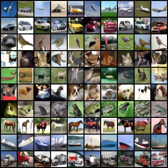
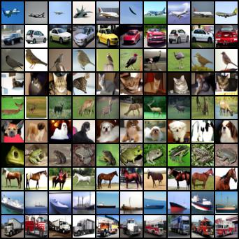
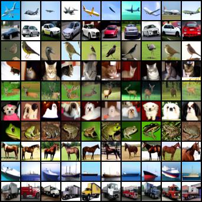

# PyTorch Implementation of V-objective Diffusion Probabilistic Model (VDPM)

## Features
- [x] improved UNet design (conditioning, resampling, etc.) [^1]
- [x] continuous-time training on log-SNR schedule [^2]
- [x] DDIM sampler [^3]
- [x] MSE loss reweighting (constant, SNR, truncated-SNR) [^4]
- [x] velocity prediction [^4]
- [x] classifier-free guidance [^5]

## Conditional generation

	<table>
        <tr>
            <th>guidance strength</th>
            <th>class</th>
            <th>images</th>
        </tr><tr>
            <td rowspan="10"><b>w=0</b></td>
            <td>airplanes</td>
            <td rowspan="10">
        </tr><tr>
            <td>cars</td>
        </tr><tr>
            <td>birds</td>
        </tr><tr>
            <td>cats</td>
        </tr><tr>
            <td>deer</td>
        </tr><tr>
            <td>dogs</td>
        </tr><tr>
            <td>frogs</td>
        </tr><tr>
            <td>horses</td>
        </tr><tr>
            <td>ships</td>
        </tr><tr>
            <td>trucks</td>
        </tr><tr>
            <td rowspan="10"><b>w=1</b></td>
            <td>airplanes</td>
            <td rowspan="10">
        </tr><tr>
            <td>cars</td>
        </tr><tr>
            <td>birds</td>
        </tr><tr>
            <td>cats</td>
        </tr><tr>
            <td>deer</td>
        </tr><tr>
            <td>dogs</td>
        </tr><tr>
            <td>frogs</td>
        </tr><tr>
            <td>horses</td>
        </tr><tr>
            <td>ships</td>
        </tr><tr>
            <td>trucks</td>
        </tr><tr>
            <td rowspan="10"><b>w=3</b></td>
			<td>airplanes</td>
			<td rowspan="10">
        </tr><tr>
            <td>cars</td>
        </tr><tr>
            <td>birds</td>
        </tr><tr>
            <td>cats</td>
        </tr><tr>
            <td>deer</td>
        </tr><tr>
            <td>dogs</td>
        </tr><tr>
            <td>frogs</td>
        </tr><tr>
            <td>horses</td>
        </tr><tr>
            <td>ships</td>
        </tr><tr>
            <td>trucks</td>
        </tr>
	</table>

## References

[^1]: Ho, Jonathan, Ajay Jain, and Pieter Abbeel. "Denoising diffusion probabilistic models." Advances in Neural Information Processing Systems 33 (2020): 6840-6851.
[^2]: Kingma, Diederik, Tim Salimans, Ben Poole, and Jonathan Ho. "Variational diffusion models." Advances in neural information processing systems 34 (2021): 21696-21707.
[^3]: Song, Jiaming, Chenlin Meng, and Stefano Ermon. "Denoising diffusion implicit models." arXiv preprint arXiv:2010.02502 (2020).
[^4]: Salimans, Tim, and Jonathan Ho. "Progressive distillation for fast sampling of diffusion models." arXiv preprint arXiv:2202.00512 (2022).
[^5]: Ho, Jonathan, Tim Salimans. ‘Classifier-Free Diffusion Guidance’. NeurIPS 2021 Workshop on Deep Generative Models and Downstream Applications, 2021. https://openreview.net/forum?id=qw8AKxfYbI.
