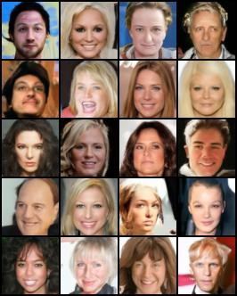
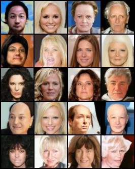
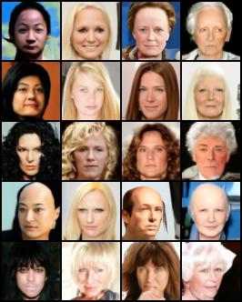
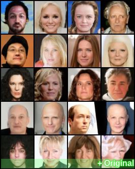
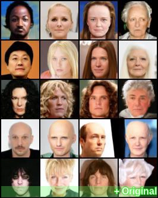
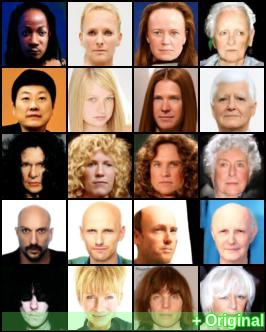

# PyTorch Implementation of V-objective Diffusion Probabilistic Model (VDPM) and more

## Key features
- [x] improved UNet design (conditioning, resampling, etc.) [^1]
- [x] continuous-time training on log-SNR schedule [^2]
- [x] DDIM sampler [^3]
- [x] MSE loss reweighting (constant, SNR, truncated-SNR) [^4]
- [x] velocity prediction [^4]
- [x] classifier-free guidance [^5]
- [x] others:
	- [x] distributed data parallel (multi-gpu training)
	- [x] gradient accumulation
	- [x] FID/Precision/Recall evaluation

## Basic usage

<details>
<summary>expand</summary>
<pre><code>
usage: train.py [-h] [--dataset {mnist,cifar10,celeba}] [--root ROOT]        
                [--epochs EPOCHS] [--lr LR] [--beta1 BETA1] [--beta2 BETA2]  
                [--weight-decay WEIGHT_DECAY] [--batch-size BATCH_SIZE]      
                [--num-accum NUM_ACCUM] [--train-timesteps TRAIN_TIMESTEPS]  
                [--sample-timesteps SAMPLE_TIMESTEPS]                        
                [--logsnr-schedule {linear,sigmoid,cosine,legacy}]           
                [--logsnr-max LOGSNR_MAX] [--logsnr-min LOGSNR_MIN]          
                [--model-out-type {x_0,eps,both,v}]                          
                [--model-var-type {fixed_small,fixed_large,fixed_medium}]    
                [--reweight-type {constant,snr,truncated_snr,alpha2}]        
                [--loss-type {kl,mse}] [--intp-frac INTP_FRAC] [--use-cfg]   
                [--w-guide W_GUIDE] [--p-uncond P_UNCOND]                    
                [--num-workers NUM_WORKERS] [--train-device TRAIN_DEVICE]    
                [--eval-device EVAL_DEVICE] [--image-dir IMAGE_DIR]          
                [--image-intv IMAGE_INTV] [--num-save-images NUM_SAVE_IMAGES]
                [--sample-bsz SAMPLE_BSZ] [--config-dir CONFIG_DIR]          
                [--chkpt-dir CHKPT_DIR] [--chkpt-name CHKPT_NAME]            
                [--chkpt-intv CHKPT_INTV] [--seed SEED] [--resume] [--eval]  
                [--use-ema] [--use-ddim] [--ema-decay EMA_DECAY]             
                [--distributed]                                    
optional arguments:                                                          
  -h, --help            show this help message and exit                      
  --dataset {mnist,cifar10,celeba}                                           
  --root ROOT           root directory of datasets                           
  --epochs EPOCHS       total number of training epochs                      
  --lr LR               learning rate                                        
  --beta1 BETA1         beta_1 in Adam                                       
  --beta2 BETA2         beta_2 in Adamffusion-torch> ^C
  --weight-decay WEIGHT_DECAYects\v-diffusion-torch> ^C
                        decoupled weight_decay factor in Adamrain.py --help
  --batch-size BATCH_SIZE
  --num-accum NUM_ACCUM
                        number of batches before weight update, a.k.a.
                        gradient accumulation
  --train-timesteps TRAIN_TIMESTEPS
                        number of diffusion steps for training (0 indicates
                        continuous training)
  --sample-timesteps SAMPLE_TIMESTEPS
                        number of diffusion steps for sampling
  --logsnr-schedule {linear,sigmoid,cosine,legacy}
  --logsnr-max LOGSNR_MAX
  --logsnr-min LOGSNR_MIN
  --model-out-type {x_0,eps,both,v}
  --model-var-type {fixed_small,fixed_large,fixed_medium}
  --reweight-type {constant,snr,truncated_snr,alpha2}
  --loss-type {kl,mse}
  --intp-frac INTP_FRAC
  --use-cfg             whether to use classifier-free guidance
  --w-guide W_GUIDE     classifier-free guidance strength
  --p-uncond P_UNCOND   probability of unconditional training
  --num-workers NUM_WORKERS
                        number of workers for data loading
  --train-device TRAIN_DEVICE
  --eval-device EVAL_DEVICE
  --image-dir IMAGE_DIR
  --image-intv IMAGE_INTV
  --num-save-images NUM_SAVE_IMAGES
                        number of images to generate & save
  --sample-bsz SAMPLE_BSZ
                        batch size for sampling
  --config-dir CONFIG_DIR
  --chkpt-dir CHKPT_DIR
  --chkpt-name CHKPT_NAME
  --chkpt-intv CHKPT_INTV
                        frequency of saving a checkpoint
  --seed SEED           random seed
  --resume              to resume training from a checkpoint
  --eval                whether to evaluate fid during training
</code></pre>
</details>

### Examples
```shell
# train cifar10 with one gpu
python train.py --dataset cifar10 --use-ema --use-ddim --num-save-images 80 --use-cfg --epochs 600 --chkpt-intv 120 --image-intv 10

# train cifar10 with two gpus
python -m torch.distributed.run --standalone --nproc_per_node 2 --rdzv_backend c10d train.py --dataset cifar10 --use-ema --use-ddim --num-save-images 80 --use-cfg --epochs 600 --chkpt-intv 120 --image-intv10 --distributed

# train celeba with one gpu with effective batch_size 128
python train.py --dataset celeba --use-ema --use-ddim --num-save-images 64 --use-cfg --epochs 240 --chkpt-intv 120 --image-intv 10 --num-accum 8 --sample-bsz 32

# train celebA with two gpus
python -m torch.distributed.run --standalone --nproc_per_node 2 --rdzv_backend c10d train.py --dataset celeba --use-ema --use-ddim --num-save-images 64 --use-cfg --epochs 240 --chkpt-intv 120 --image-intv 10 --distributed --num-accum 4 --sample-bsz 32
```
## Conditional generation

### CIFAR-10

<p align="center">
	<table>
        <tr>
            <th>guidance strength</th>
            <th>class</th>
            <th>images</th>
        </tr><tr>
            <td rowspan="10"><b>w=0</b></td>
            <td>airplanes</td>
            <td rowspan="10">
        </tr><tr>
            <td>cars</td>
        </tr><tr>
            <td>birds</td>
        </tr><tr>
            <td>cats</td>
        </tr><tr>
            <td>deer</td>
        </tr><tr>
            <td>dogs</td>
        </tr><tr>
            <td>frogs</td>
        </tr><tr>
            <td>horses</td>
        </tr><tr>
            <td>ships</td>
        </tr><tr>
            <td>trucks</td>
        </tr><tr>
            <td rowspan="10"><b>w=1</b></td>
            <td>airplanes</td>
            <td rowspan="10">
        </tr><tr>
            <td>cars</td>
        </tr><tr>
            <td>birds</td>
        </tr><tr>
            <td>cats</td>
        </tr><tr>
            <td>deer</td>
        </tr><tr>
            <td>dogs</td>
        </tr><tr>
            <td>frogs</td>
        </tr><tr>
            <td>horses</td>
        </tr><tr>
            <td>ships</td>
        </tr><tr>
            <td>trucks</td>
        </tr><tr>
            <td rowspan="10"><b>w=3</b></td>
			<td>airplanes</td>
			<td rowspan="10">
        </tr><tr>
            <td>cars</td>
        </tr><tr>
            <td>birds</td>
        </tr><tr>
            <td>cats</td>
        </tr><tr>
            <td>deer</td>
        </tr><tr>
            <td>dogs</td>
        </tr><tr>
            <td>frogs</td>
        </tr><tr>
            <td>horses</td>
        </tr><tr>
            <td>ships</td>
        </tr><tr>
            <td>trucks</td>
        </tr>
	</table>
</p>

### CelebA

<p align="center">
	<table>
        <tr>
            <th>guidance strength</th>
            <th>tag</th>
            <th>Black_Hair</th>
            <th>Blond_Hair</th>
            <th>Brown_Hair</th>
            <th>Gray_Hair</th>
        </tr><tr>
        	<td rowspan="5"><b>w=0</b></td>
            <td>Receding_Hairline</td>
            <td rowspan="5" colspan="4">
        </tr><tr>
			<td>Straight_Hair</td>
        </tr><tr>
			<td>Wavy_Hair</td>
        </tr><tr>
            <td>Bald</td>
        </tr><tr>
            <td>Bangs</td>
        </tr><tr>
        	<td rowspan="5"><b>w=1</b></td>
            <td>Receding_Hairline</td>
            <td rowspan="5" colspan="4">
        </tr><tr>
			<td>Straight_Hair</td>
        </tr><tr>
			<td>Wavy_Hair</td>
        </tr><tr>
            <td>Bald</td>
        </tr><tr>
            <td>Bangs</td>
        </tr><tr>
        	<td rowspan="5"><b>w=3</b></td>
            <td>Receding_Hairline</td>
            <td rowspan="5" colspan="4">
        </tr><tr>
			<td>Straight_Hair</td>
        </tr><tr>
			<td>Wavy_Hair</td>
        </tr><tr>
            <td>Bald</td>
        </tr><tr>
            <td>Bangs</td>
        </tr>
	</table>
</p>

<details>
<summary>More variants (animated)</summary>
<p align="center">
	<table>
        <tr>
            <th>guidance strength</th>
            <th>tag</th>
            <th>Black_Hair</th>
            <th>Blond_Hair</th>
            <th>Brown_Hair</th>
            <th>Gray_Hair</th>
        </tr><tr>
        	<td rowspan="5"><b>w=0</b></td>
            <td>Receding_Hairline</td>
            <td rowspan="5" colspan="4">
        </tr><tr>
			<td>Straight_Hair</td>
        </tr><tr>
			<td>Wavy_Hair</td>
        </tr><tr>
            <td>Bald</td>
        </tr><tr>
            <td>Bangs</td>
        </tr><tr>
        	<td rowspan="5"><b>w=1</b></td>
            <td>Receding_Hairline</td>
            <td rowspan="5" colspan="4">
        </tr><tr>
			<td>Straight_Hair</td>
        </tr><tr>
			<td>Wavy_Hair</td>
        </tr><tr>
            <td>Bald</td>
        </tr><tr>
            <td>Bangs</td>
        </tr><tr>
        	<td rowspan="5"><b>w=3</b></td>
            <td>Receding_Hairline</td>
            <td rowspan="5" colspan="4">
        </tr><tr>
			<td>Straight_Hair</td>
        </tr><tr>
			<td>Wavy_Hair</td>
        </tr><tr>
            <td>Bald</td>
        </tr><tr>
            <td>Bangs</td>
        </tr>
	</table>
</p>
</details>

## Acknowledgement

The development of this codebase is largely based on the official JAX implementation open-sourced by *Google Research* and my previous PyTorch implementation of DDPM, which are available at [[google-research/diffusion_distillation]](https://github.com/google-research/google-research/tree/master/diffusion_distillation/diffusion_distillation) and [[tqch/ddpm-torch]](https://github.com/tqch/ddpm-torch) respectively.

## References

[^1]: Ho, Jonathan, Ajay Jain, and Pieter Abbeel. "Denoising diffusion probabilistic models." Advances in Neural Information Processing Systems 33 (2020): 6840-6851.
[^2]: Kingma, Diederik, Tim Salimans, Ben Poole, and Jonathan Ho. "Variational diffusion models." Advances in neural information processing systems 34 (2021): 21696-21707.
[^3]: Song, Jiaming, Chenlin Meng, and Stefano Ermon. "Denoising diffusion implicit models." arXiv preprint arXiv:2010.02502 (2020).
[^4]: Salimans, Tim, and Jonathan Ho. "Progressive distillation for fast sampling of diffusion models." arXiv preprint arXiv:2202.00512 (2022).
[^5]: Ho, Jonathan, Tim Salimans. ‘Classifier-Free Diffusion Guidance’. NeurIPS 2021 Workshop on Deep Generative Models and Downstream Applications, 2021. https://openreview.net/forum?id=qw8AKxfYbI.

